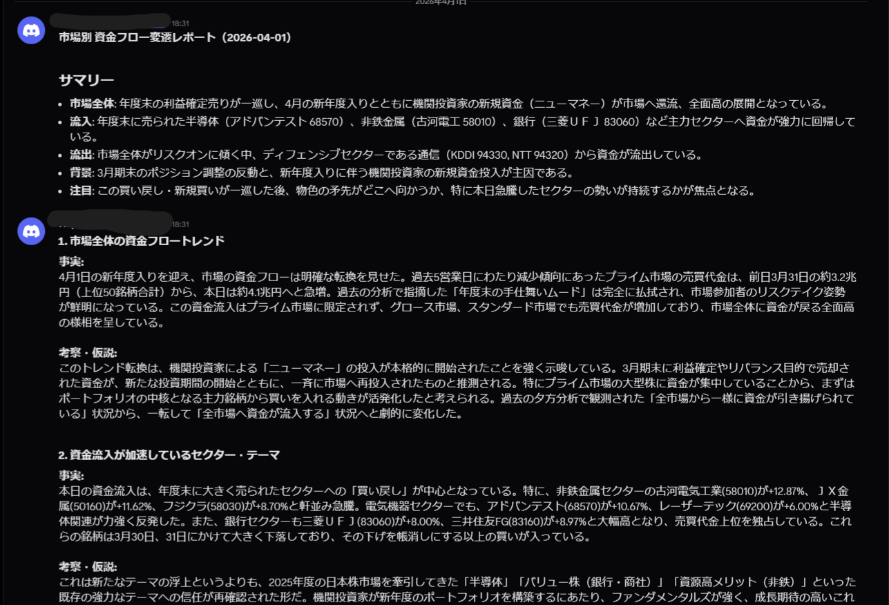

# jquants-ELT-sample

A production-grade, fully serverless **ELT pipeline** on GCP that ingests daily Japanese equity market data from the [J-Quants API](https://jpx-jquants.com/), stages it in BigQuery, and transforms it with Dataform into a Looker Studio monitoring dashboard — all provisioned via Terraform and deployed through a GitOps CI/CD workflow.

The pipeline handles **5 data feeds** across multiple schedules, serves **3,900+ listed equities** on JPX (Prime / Growth / Standard markets), and runs unattended every trading day with statistical data quality monitoring and Discord alerting.

## Technical Highlights

- **Zero-server architecture**: Cloud Run Jobs (batch) + Cloud Run Services (API) + Cloud Workflows (orchestration) — no VMs, no persistent processes, pay-per-execution
- **Full Infrastructure as Code**: Every GCP resource — IAM, GCS, BigQuery, Artifact Registry, Cloud Build triggers, Dataform, Secret Manager — is declared in Terraform and version-controlled
- **GitOps multi-environment**: Branch push (`develop` / `main`) is the single deployment trigger; dev and prod are structurally identical, isolated by dataset naming convention
- **Composable data quality checks**: A `QualityChecker` context manager exposes per-pipeline checks (`check_row_count`, `check_null_rate_anomaly`, `check_not_null_static`, `check_not_null_dynamic`, `check_allowed_values`, `check_value_range`); failures are aggregated into a single Discord alert per run without blocking the pipeline
- **Idempotent loads**: Daily BigQuery partitions are overwritten on re-run (`WRITE_TRUNCATE`), making backfills and reruns safe by design
- **Self-healing CI/CD**: Cloud Build deletes Cloud Run / Workflows / Scheduler resources that no longer exist in the repository, preventing orphaned infrastructure drift

## Architecture

```
Cloud Scheduler (OIDC)
  └─► workflow_dispatcher (Cloud Run Service)
        └─► Cloud Workflows
              ├─► market_open (Cloud Run Service) ── skip if market closed
              ├─► ingest_to_gcs  (Cloud Run Job)  ── J-Quants API → GCS Parquet
              ├─► load_to_bigquery (Cloud Run Job) ── GCS → BigQuery (partitioned)
              └─► check_quality   (Cloud Run Job)  ── QualityChecker composable checks → Discord
                                                        │
                                                   Dataform (triggered after load)
                                                        └─► mart.report_stock_dashboard
                                                                   │
                                                            Looker Studio Dashboard
```

Each pipeline is independently deployable. The orchestration layer (`workflow.yaml`) and the job implementations are colocated per pipeline, so adding a new feed requires only a new directory — no changes to shared infrastructure.

## Data Pipelines

| Pipeline | Data Source | Schedule (JST) | BigQuery Table |
|---|---|---|---|
| `jquants_ohlcv` | Daily OHLCV (bars) | 16:35 weekdays | `staging_jquants.daily_quotes` |
| `jquants_fins_summary` | Financial summary (preliminary) | 18:05 weekdays | `staging_jquants.fins_summary` |
| `jquants_fins_summary_confirmed` | Financial summary (confirmed) | 01:30 weekdays | `staging_jquants.fins_summary` |
| `jquants_earnings_calendar` | Earnings calendar | 19:30 weekdays | `staging_jquants.earnings_calendar` |
| `jquants_master` | Company master | 03:00 on 10th of month | `staging_jquants.master` |
| `daily_monitoring_dashboard` | Dataform transform | 18:20 weekdays | `mart.report_stock_dashboard` |

`jquants_fins_summary_confirmed` reuses the ingest/load/check_quality jobs from `jquants_fins_summary` and overwrites the same table with confirmed (revised) financial figures.

## Key Design Decisions

### ELT over ETL — type safety without schema coupling
Raw data is landed in GCS as Parquet without transformation, then loaded to BigQuery in two stages: (1) GCS Parquet → temporary table using type inference, (2) a CAST SQL query writes to the final date-partitioned table with explicit types. The temp table is always deleted in a `finally` block. This decouples schema evolution from ingestion: upstream type changes surface as explicit cast failures rather than silent data corruption.

### Market-aware scheduling via API
Every workflow begins with a call to the J-Quants trading calendar API. If the target date is a non-business day, the workflow exits early. This eliminates the need to maintain a holiday calendar and keeps schedules simple (daily cron regardless of market calendar).

### Retry logic for API update latency
The OHLCV pipeline retries up to 6 times at 5-minute intervals when 0 records are returned. The J-Quants API for daily prices is updated after market close and the exact timing varies; polling is safer than a fixed delay.

### Composable quality checks — aggregated alerting, never blocking
Each `check_quality` job opens a `quality_check_context()` and composes per-pipeline checks inside the `with` block. Individual failures accumulate as warnings in Cloud Logging; on block exit, a single aggregated Discord message is sent automatically (the context manager guarantees the call, eliminating "forgot to notify" bugs). Jobs always exit 0 — quality issues are warnings, not blockers, since upstream API issues cannot be fixed by retrying the workflow.

Available checks on the `QualityChecker`:
- **`check_row_count`** — current-day row count vs. previous N-day average (threshold ratio)
- **`check_null_rate_anomaly`** — NULL-rate delta against the previous N-day baseline
- **`check_not_null_static`** — explicit must-not-be-null columns (any NULL alerts)
- **`check_not_null_dynamic`** — required columns auto-detected per dimension from historical NULL rate (e.g. `DocType`-keyed columns whose 365-day NULL rate ≤ 5%)
- **`check_allowed_values`** — values outside an allow-list (early-detect upstream schema changes)
- **`check_value_range`** — values outside `[min, max]`

Discord notification failures are caught and logged at ERROR — a webhook outage never breaks the job.

### API version migration with zero downstream impact
The J-Quants v2 API uses abbreviated column names (`O`, `H`, `L`, `C`, `Vo`, etc.). The ingestion layer maps these back to the v1 full names (`Open`, `High`, `Low`, `Close`, `Volume`, etc.) before writing to Parquet — keeping the BigQuery schema and all downstream SQL unchanged across the API version migration.

### Secrets and auth — zero credentials in the repository
All API keys and tokens are stored in GCP Secret Manager and fetched at runtime. Cloud Scheduler authenticates to Cloud Run via OIDC (no service account key files). The workflow dispatcher validates an allowlist of permitted workflow names before forwarding triggers, preventing arbitrary execution via the HTTP endpoint.

### Declarative pipeline registration
Each pipeline's `workflow.yaml` carries a `__metadata__` block that declares its own Cloud Scheduler cron expression and job list. The CI/CD pipeline reads these metadata blocks and creates/updates/deletes Scheduler jobs and Cloud Workflows accordingly. Adding a new pipeline requires no changes outside its own directory.

## GCP Services Used

| Service | Role |
|---|---|
| Cloud Run (Services) | `market_open` trading calendar check, `workflow_dispatcher` trigger bridge |
| Cloud Run (Jobs) | Per-pipeline ingest, load, and quality check jobs |
| Cloud Workflows | Orchestration, market-open gating, retry logic, error handling |
| Cloud Scheduler | Cron triggers via OIDC to dispatcher |
| Cloud Storage | Data lake — Parquet files partitioned by date |
| BigQuery | Staging tables (date-partitioned) + Dataform mart + pipeline metadata |
| Dataform | SQL transformations and mart table management |
| Artifact Registry | Docker image registry (shared image for all jobs) |
| Cloud Build | CI/CD pipeline — build, deploy, and resource cleanup |
| Secret Manager | API keys and tokens (zero credentials in repo) |

## Repository Structure

```
.
├── build_deploy.yaml          # Cloud Build CI/CD pipeline (single source of truth)
├── Dockerfile                 # Shared container image for all jobs and services
├── requirements.txt           # Python dependencies
├── package.json               # Dataform Node.js dependencies (@dataform/core)
├── dataform.json              # Dataform project configuration
├── libs/                      # Shared Python libraries
│   ├── config.py              # GCP resource naming conventions
│   ├── utils.py               # GCS, Secret Manager, env helpers
│   ├── utils_bigquery.py      # BigQuery load with 2-stage CAST
│   ├── utils_data_quality.py  # QualityChecker: composable checks + aggregated Discord alert
│   ├── utils_discord.py       # Discord error notifications
│   ├── utils_jquants.py       # J-Quants API client (paginated)
│   └── utils_metadata.py      # Pipeline run metadata recording
├── services/
│   ├── market_open/           # FastAPI: checks if market is open via J-Quants
│   └── workflow_dispatcher/   # FastAPI: bridges Cloud Scheduler → Cloud Workflows
├── workflows/
│   ├── ingest/                # One directory per ingestion pipeline
│   │   ├── jquants_ohlcv/
│   │   │   ├── workflow.yaml          # Cloud Workflows definition + schedule metadata
│   │   │   ├── job__ingest_to_gcs.py  # Fetch from J-Quants API → GCS
│   │   │   ├── job__load_to_bigquery.py # GCS Parquet → BigQuery
│   │   │   └── job__check_quality.py  # Composes QualityChecker checks for this pipeline
│   │   ├── jquants_fins_summary/
│   │   ├── jquants_fins_summary_confirmed/
│   │   ├── jquants_earnings_calendar/
│   │   └── jquants_master/
│   ├── transform/
│   │   └── daily_monitoring_dashboard/ # Triggers Dataform compilation + invocation
│   └── utils/
│       └── backfill_executor/  # Sequential backfill for a date range
├── definitions/               # Dataform SQL transformations
│   ├── sources/jquants/       # Source declarations (point to staging tables)
│   ├── intermediate/
│   │   └── int_daily_stock_metrics.sqlx  # Enriched metrics (price changes, flags, market cap)
│   └── reports/
│       └── report_stock_dashboard.sqlx   # Final Looker Studio table (last 5 trading days)
├── includes/
│   └── env.js                 # Dataform env vars (dataset names)
└── terraform/                 # Infrastructure as Code
    ├── bootstrap.sh           # One-time setup: create state bucket + terraform init
    ├── terraform.tfvars.template
    ├── main.tf                # Terraform backend (GCS) + provider config
    ├── variables.tf
    ├── apis.tf                # GCP API enablement
    ├── iam.tf                 # Service accounts + IAM bindings
    ├── gcs.tf                 # Data lake buckets
    ├── bigquery.tf            # BigQuery datasets + IAM
    ├── artifact_registry.tf   # Docker registry
    ├── cloudbuild.tf          # Cloud Build triggers (dev/prod)
    ├── dataform.tf            # Dataform repositories
    └── secret_manager.tf      # Secret shells (values set manually)
```

## Prerequisites

- GCP project with billing enabled
- `gcloud` CLI authenticated (`gcloud auth application-default login`)
- Terraform >= 1.5
- GitHub repository connected to Cloud Build (via Cloud Build GitHub App)
- J-Quants API key ([sign up](https://jpx-jquants.com/))

## Deployment

### 1. Bootstrap Terraform

```bash
cd terraform/
./bootstrap.sh gcp-jquants-elt-sample asia-northeast1
```

This creates the GCS state bucket, generates `terraform.tfvars` from the template, and runs `terraform init`.

### 2. Configure variables

Edit `terraform/terraform.tfvars`:

```hcl
project_id      = "gcp-jquants-elt-sample"
region          = "asia-northeast1"
github_repo_url = "https://github.com/<YOUR_OWNER>/jquants-ELT-sample.git"
```

### 3. Apply infrastructure

```bash
cd terraform/
terraform plan
terraform apply
```

This provisions all GCP resources: service accounts, IAM roles, GCS buckets, BigQuery datasets, Artifact Registry, Cloud Build triggers, Dataform repositories, and Secret Manager shells.

### 4. Set secrets

```bash
# J-Quants API key (required)
echo -n "YOUR_JQUANTS_API_KEY" | \
  gcloud secrets versions add jquants-api-key \
  --project=gcp-jquants-elt-sample \
  --data-file=-

# Discord webhook for error notifications (required)
echo -n "<YOUR_DISCORD_WEBHOOK_URL>" | \
  gcloud secrets versions add discord-webhook-url \
  --project=gcp-jquants-elt-sample \
  --data-file=-

# GitHub token for Dataform Git sync (required)
echo -n "<YOUR_GITHUB_PERSONAL_ACCESS_TOKEN>" | \
  gcloud secrets versions add dataform-github \
  --project=gcp-jquants-elt-sample \
  --data-file=-
```

### 5. Connect GitHub to Cloud Build

In the GCP Console → Cloud Build → Triggers, connect the GitHub App to your repository. The `dev-deploy` and `prod-deploy` triggers are already configured by Terraform.

### 6. Deploy

Push to the `develop` branch to trigger the dev deployment:

```bash
git checkout -b develop
git push origin develop
```

Cloud Build will:
1. Build and push the Docker image to Artifact Registry
2. Deploy Cloud Run Services (`market_open`, `workflow_dispatcher`)
3. Deploy Cloud Run Jobs for each pipeline step
4. Deploy Cloud Workflows with rendered YAML
5. Create/update Cloud Scheduler jobs
6. Clean up orphaned resources no longer present in the repository

### Backfill

To backfill historical data for a pipeline, trigger the `backfill_executor` workflow manually from the GCP Console or via `gcloud`:

```bash
gcloud workflows run dev--backfill_executor \
  --location=asia-northeast1 \
  --data='{"workflow_name": "dev--jquants_ohlcv", "start": "2025-01-01", "end": "2025-01-31"}'
```

## Looker Studio Dashboard

The `mart.report_stock_dashboard` table is refreshed daily after market close. It contains the last 5 trading days of enriched stock metrics:

- **Price metrics**: OHLCV, adjusted close/volume, stop-high/low flags
- **Momentum**: Price change % (1d / 5d / 20d / 60d), turnover change %
- **Fundamentals**: Market cap (million JPY), last earnings date, next earnings date
- **Rankings**: Turnover rank within each market (Prime / Growth / Standard)

Connect Looker Studio to the `mart_prod.report_stock_dashboard` BigQuery table and set a daily refresh schedule.

## Example Output

The following is an example of what can be built on top of this pipeline. The application (not included in this repository) consumes the BigQuery mart tables and delivers daily analysis reports to Discord.

### Daily Sector Fund Flow Report (Discord)



The example above shows one of several analysis reports delivered each evening after market close. Reports include (but are not limited to):

- **Market summary**: Overall fund flow trends, new money / rotation signals
- **Sector analysis**: Top inflows/outflows by sector with specific stock highlights
- **Themes**: Momentum themes active on the day

## Environment Strategy

| Branch | Environment | BigQuery Datasets |
|---|---|---|
| `develop` | dev | `staging_jquants_dev`, `pipeline_metadata_dev`, `mart_dev` |
| `main` | prod | `staging_jquants_prod`, `pipeline_metadata_prod`, `mart_prod` |

Dev schedulers are automatically paused when a prod deployment runs.
